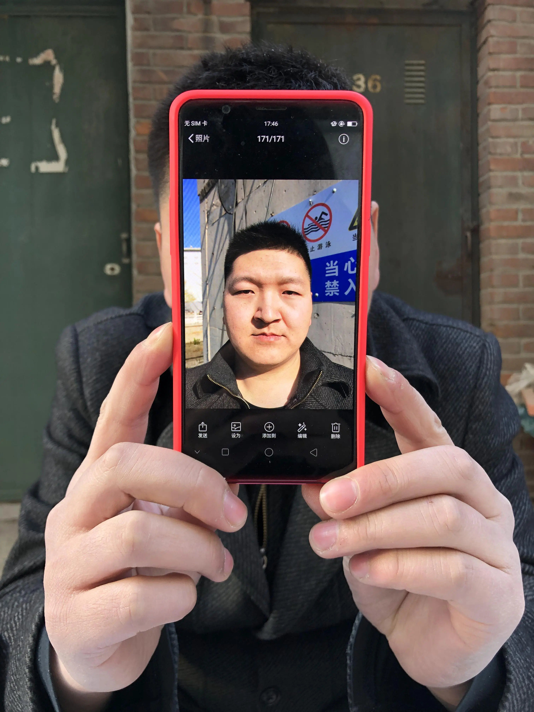
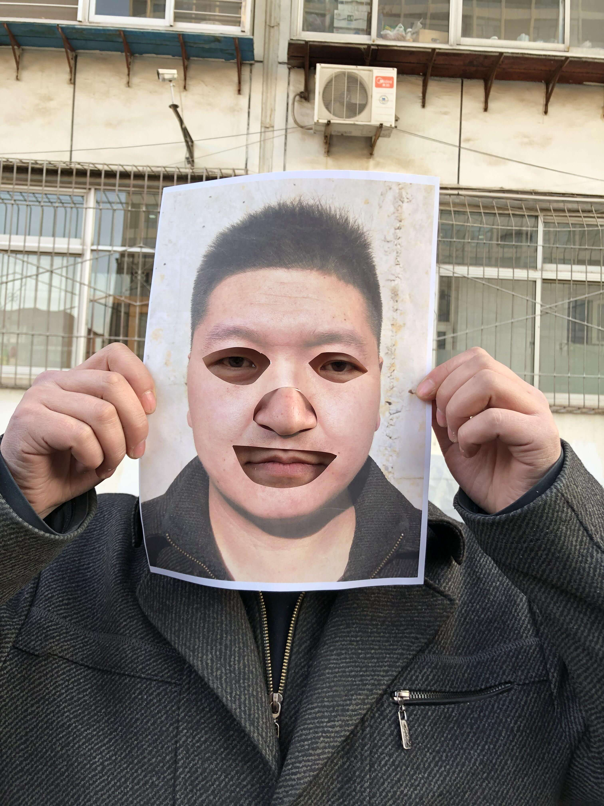
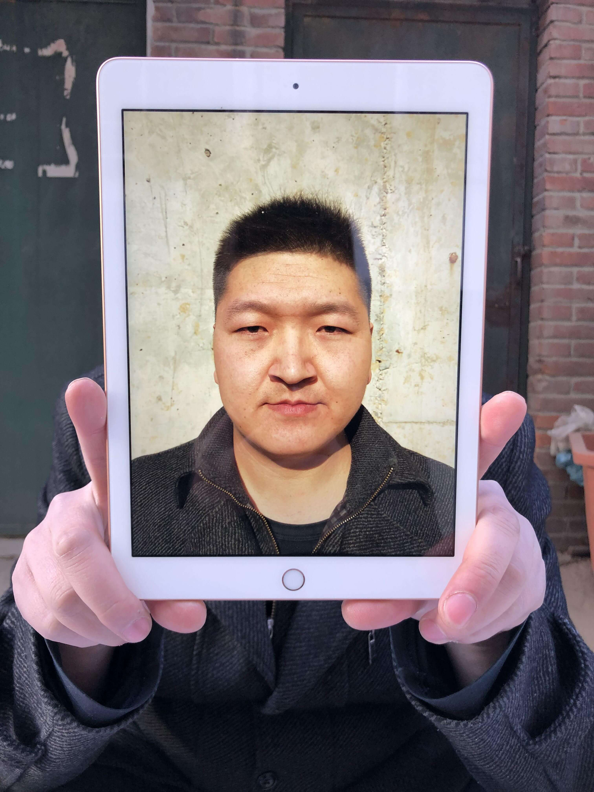

# Passive Face Liveness Verification Solution

Welcome to the official page for our **Passive Face Liveness Verification Solution**! This solution leverages AI and computer vision techniques to ensure secure and frictionless identity verification.

## Overview
Passive face liveness verification determines whether a face presented to the camera is real (from a live person) or fake (such as a photo, video, or mask) without requiring any user action. This solution is ideal for seamless user onboarding, enhancing security, and reducing fraud in industries like banking, fintech, telecom, and e-commerce.

---

## Key Features
- **Non-Intrusive Verification**: Users don't need to perform any specific actions or gestures.
- **AI-Powered Detection**: Utilizes deep learning models to detect spoofing attempts.
- **Real-Time Processing**: Fast and efficient verification, suitable for high-traffic systems.
- **Device Agnostic**: Compatible with smartphones, webcams, and other camera devices.
- **High Accuracy**: Robust against various spoofing techniques like photos, videos, and 3D masks.

---

## Benefits
- **Enhanced Security**: Prevents fraudulent access using spoofing techniques.
- **User-Friendly**: Seamless verification process without interrupting user experience.
- **Cost-Effective**: Reduces manual verification efforts and fraud-related losses.
- **Scalable Solution**: Handles high volumes of verification requests.

---

## How It Works
1. **Capture**: A face image is captured through the user's device.
2. **Preprocessing**: The captured data is analyzed and preprocessed to ensure quality and compatibility.
3. **AI Analysis**: Deep learning algorithms evaluate the input to detect signs of liveness or spoofing.
4. **Result**: A liveness score is generated, indicating whether the face is genuine or fake.

---

## Example Spoof Attacks

### 1. Printed Photo Spoof

### 2. Screen Replay Attack

### 3. Printed Photo with Cut-Out Eyes, Nose & Mouth 

### 4. Tablet Replay Attack

---

## Use Cases

Face liveness verification has become a critical solution across industries to enhance security, 
improve operational efficiency, and deliver seamless user experiences. By leveraging advanced 
AI and biometric technologies, it ensures that the person behind an interaction is physically 
present and not using fraudulent methods like photos, videos, or masks. Industries such as 
*Banks*, Finetech, government, education, telecom, insurance, travel, hospitality, e-commerce, 
and more benefit significantly from implementing liveness verification in their processes.

Whether it's enabling secure digital onboarding, preventing identity fraud, authenticating remote users, 
or streamlining customer interactions, liveness verification addresses modern challenges while building 
trust and compliance. Below are detailed use cases tailored to specific industries to help businesses 
understand how to integrate and benefit from this innovative technology.

### 1) Financial Services(Banks, finetech):
#### i) Digital Onboarding & KYC Compliance:
Banks and fintech companies can use our liveness solution to authenticate customers during 
account opening, ensuring only real users create accounts.

*Example*: A banking app integrates our solution to match a selfie with an uploaded ID 
document and verify that the person is physically present, reducing fake account creation by fraudsters.

#### ii) Fraud Prevention in Transactions:
Payment platforms and banks can implement our liveness solution to secure high-value 
transactions by verifying that the account owner is authorizing the activity.

*Example*: A digital wallet provider integrates liveness verification for transactions 
over a certain limit, preventing unauthorized transfers from hacked accounts.

#### iii) Loan Approvals
Lenders can use our liveness solution to authenticate borrowers before loan disbursement, 
minimizing fraud risks and identity theft.

---

### 2) Government and Public Sector
#### i) Border Control and Immigration:
Immigration and customs departments can use our liveness solution to enhance security and streamline traveler verification.

*Example*: Automated kiosks at international airports scan traveler's faces and perform liveness checks to confirm their identities before allowing entry, reducing delays and enhancing security.

#### ii) Digital Identity Programs:
Governments can use our liveness solution to enhance digital identity systems by ensuring that registered citizens or residents are real individuals and not fraudsters.

#### iii) Social Welfare Distribution
Government agencies can deploy our liveness solution to authenticate beneficiaries and prevent misuse of welfare schemes.

---

### 3) Education Sector:
#### i) Student Attendance Systems:
*Schools* and *universities* can adopt our liveness solution to automate attendance tracking and ensure accuracy.

#### ii) Remote Exam Proctoring:
Educational institutions and e-learning platforms can use our liveness solution to verify students' identities during online exams, ensuring integrity and preventing cheating.

---

### 4) Insurance:
#### i) Policy Issuance and Fraud Prevention:
Insurance companies can use our liveness solution to verify customers identities during policy issuance and prevent fraudulent applications.

#### ii) Claim Processing and Beneficiary Verification:
Insurers can adopt our liveness solution to authenticate claimants and beneficiaries before approving payouts, ensuring security and reducing fraud.

---

### 5) Travel and Hospitality:
#### i) Airport Security and Immigration:
Airports and border control agencies can implement our liveness solution to enhance traveler authentication at security checkpoints and immigration.

*Example*: Automated kiosks at airports use liveness verification to confirm travelers identities against their passports, reducing queues and improving security.

#### ii) Secure and Contactless Check-Ins:
Hotels and airlines can use our liveness solution to streamline check-ins, ensuring secure and contactless authentication for travelers.

*Example*: A hotel allows guests to check in by scanning their faces with liveness detection, eliminating the need for physical documents or waiting at the reception desk.

---

## Contact
For inquiries or support, please contact us:

- *Email*: [boyanenivratti@gmail.com](mailto:boyanenivratti@gmail.com)

---

Thank you for exploring our Passive Face Liveness Verification Solution! Together, let's build a more secure and seamless digital world.

