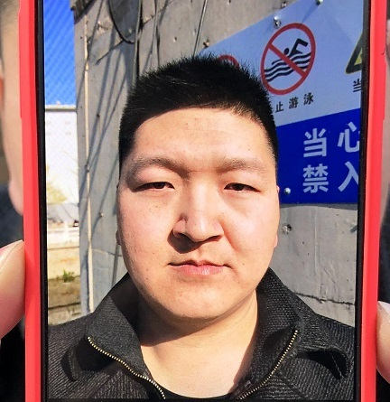
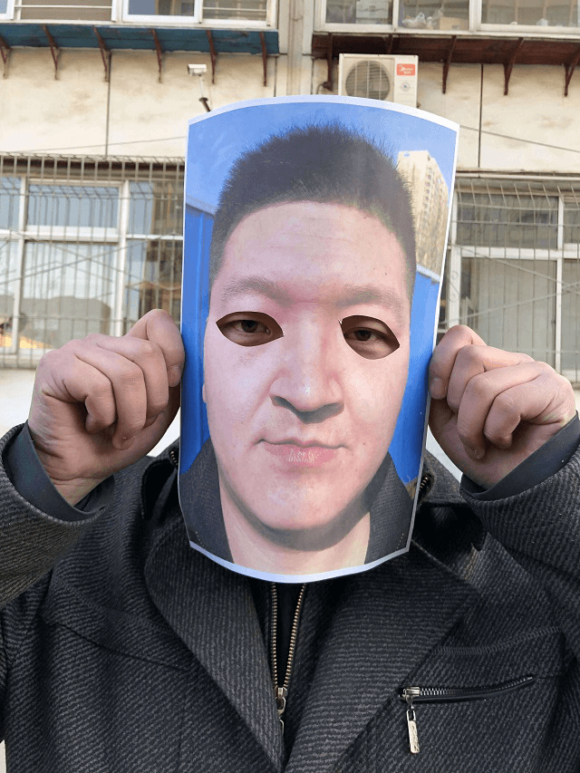

# Passive Face Liveness Verification Solution

Welcome to the official page for our **Passive Face Liveness Verification Solution**! This solution leverages AI and computer vision techniques to ensure secure and frictionless identity verification.

## Overview
Passive face liveness verification determines whether a face presented to the camera is real (from a live person) or fake (such as a photo, video, or mask) without requiring any user action. This solution is ideal for seamless user onboarding, enhancing security, and reducing fraud in industries like banking, fintech, telecom, and e-commerce.

---

## Key Features
- **Non-Intrusive Verification**: Users don’t need to perform any specific actions or gestures.
- **AI-Powered Detection**: Utilizes deep learning models to detect spoofing attempts.
- **Real-Time Processing**: Fast and efficient verification, suitable for high-traffic systems.
- **Device Agnostic**: Compatible with smartphones, webcams, and other camera devices.
- **High Accuracy**: Robust against various spoofing techniques like photos, videos, and 3D masks.

---

## Benefits
- **Enhanced Security**: Prevents fraudulent access using spoofing techniques.
- **User-Friendly**: Seamless verification process without interrupting user experience.
- **Cost-Effective**: Reduces manual verification efforts and fraud-related losses.
- **Scalable Solution**: Handles high volumes of verification requests.

---

## How It Works
1. **Capture**: A face image is captured through the user’s device.
2. **Preprocessing**: The captured data is analyzed and preprocessed to ensure quality and compatibility.
3. **AI Analysis**: Deep learning algorithms evaluate the input to detect signs of liveness or spoofing.
4. **Result**: A liveness score is generated, indicating whether the face is genuine or fake.

---

## Example Spoof Attacks

### 1. Printed Photo Spoof

### 2. Screen Replay Attack

### 3. Mask with Cut-Out Eyes

### 4. Tablet Replay Attack

---

## Use Cases
- **Digital Onboarding**: Verify users during online account creation.
- **Fraud Prevention**: Prevent spoofing attempts in payment systems.
- **Access Control**: Secure physical or digital environments with biometric authentication.

---

## Contact
For inquiries or support, please contact us:

- *Email*: [boyanenivratti@gmail.com](mailto:boyanenivratti@gmail.com)

---

Thank you for exploring our Passive Face Liveness Verification Solution! Together, let’s build a more secure and seamless digital world.

